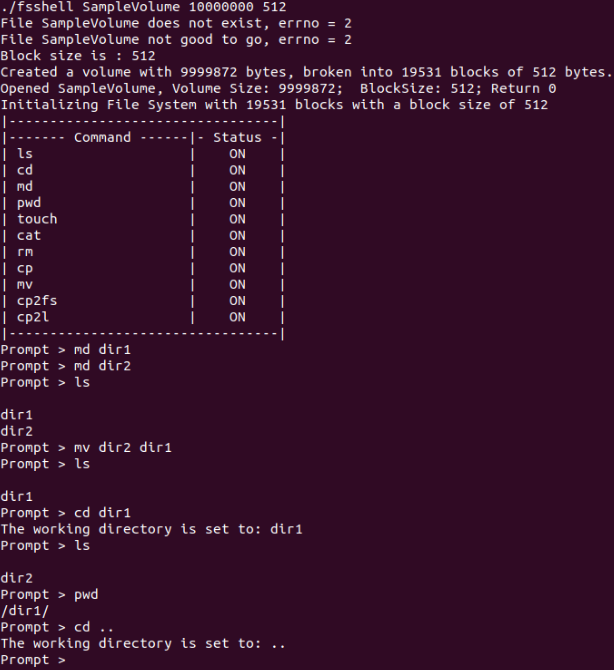
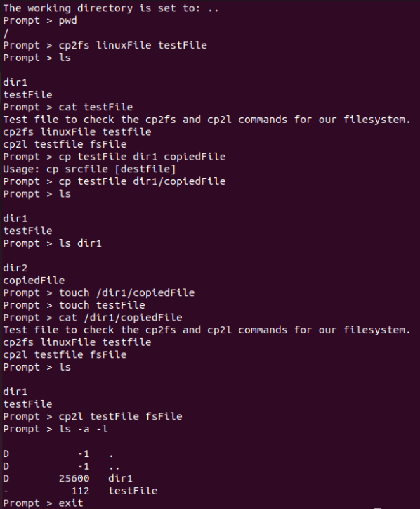
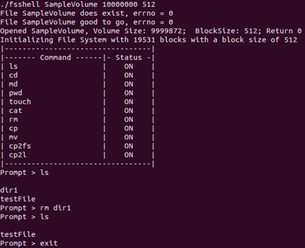
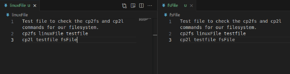

# Operating Systems Class Term Project - File System

**Learning Outcomes:**
- Large scale project planning
- Understanding the file system
- Understanding of low level file functionality
- Multi-Phased Project
- Advanced buffering
- Freespace allocation and release management
- Persistence
- Directory structures
- Tracking file information 

**This file system does the following:**  
Format the volume, create and maintain a free space management system, initialize a root directory and maintain directory information, create, read, write, and delete files, and display info.  
Our system uses extents to manage free space and allocated spaces, with support for discontigious file allocation.  
Please read our [documentation and write up](https://github.com/KaiserMighty/LowLevel-FileSystem/blob/main/Writeup%20and%20Documentation.pdf) for description of the systems, writeup of each individual function, a hex dump analysis, and more.  

A shell program designed to demonstrate the file system called fsshell.c is provided.  It has a number of built in functions:
```
ls - Lists the file in a directory
cp - Copies a file - source [dest]
mv - Moves a file - source dest
md - Make a new directory
rm - Removes a file or directory
touch - creates a file
cat - (limited functionality) displays the contents of a file
cp2l - Copies a file from the test file system to the linux file system
cp2fs - Copies a file from the Linux file system to the test file system
cd - Changes directory
pwd - Prints the working directory
history - Prints out the history
help - Prints out help
```

## Preview Screenshots
### Initialize FS, create and move directories, change directories, list items.  
  
### Copy a file from linux to our FS, read a file from our FS, copy a file from our FS back to linux.  
  
### Restart FS to check for persistence to make sure it saved everything to disk, delete a directory.  
  
### Comparing files after import into and export out of our FS. Left is pre-import, right is post-export. Identical files means our FS works correctly.  

